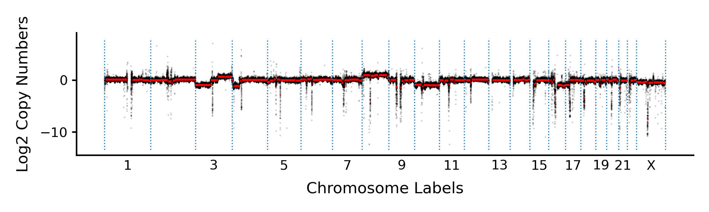
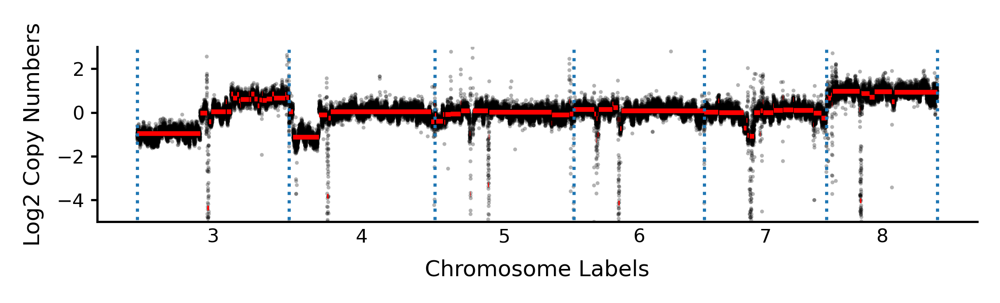
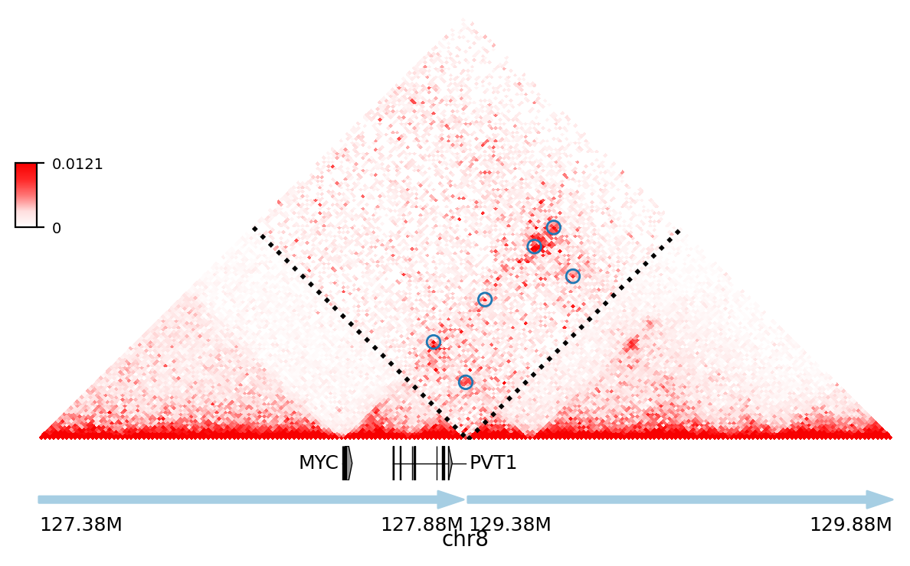
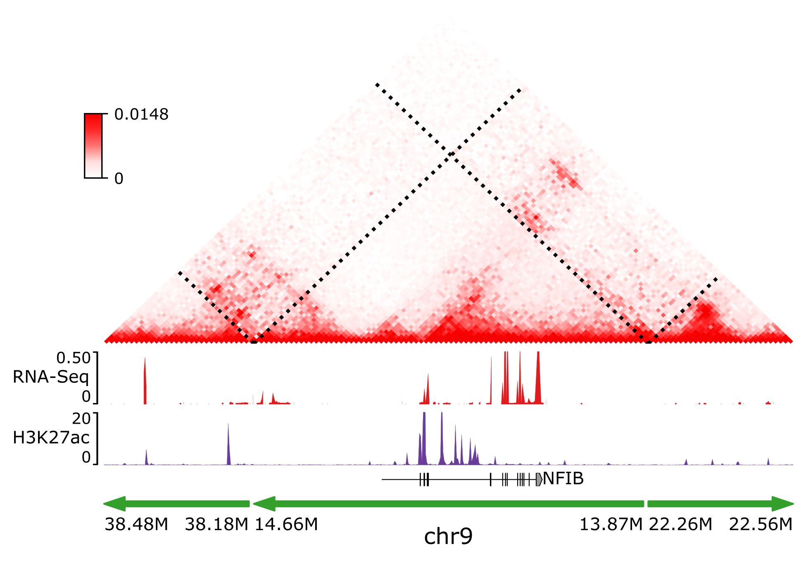
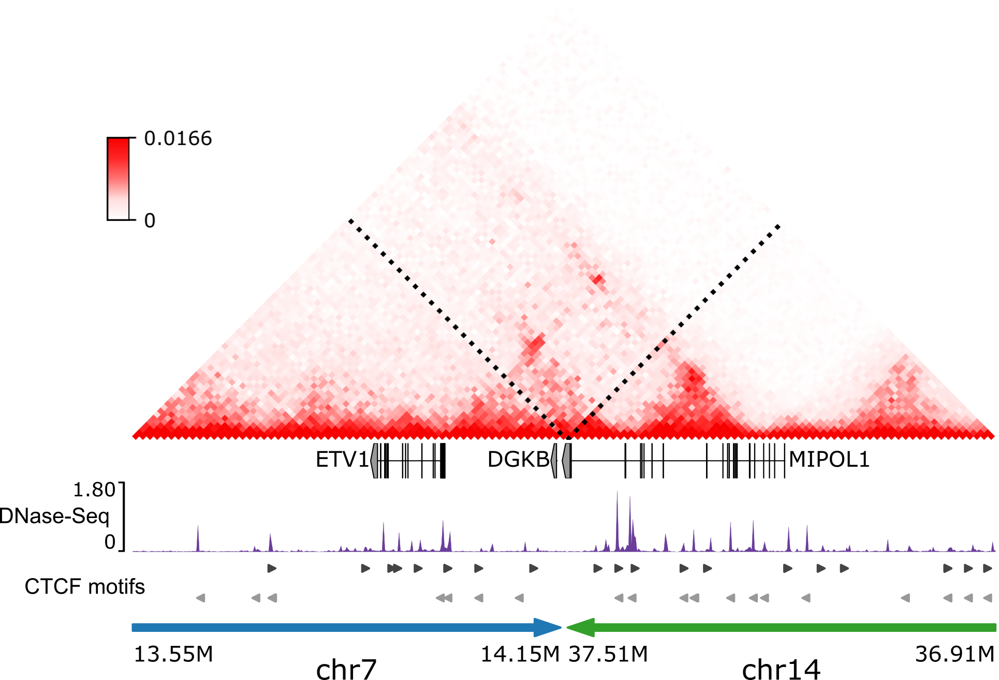
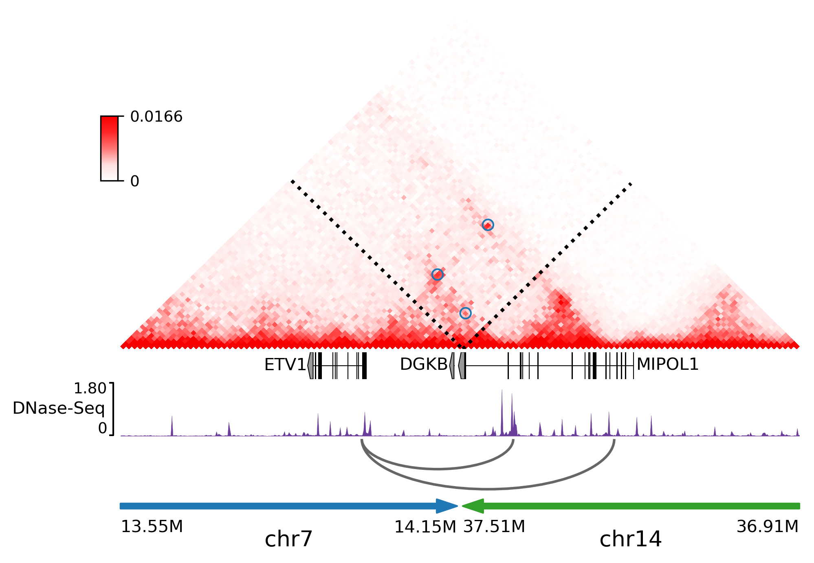

Neo-loop Finder
***************
.. image:: https://codeocean.com/codeocean-assets/badge/open-in-code-ocean.svg
   :target: https://codeocean.com/capsule/8407443/tree/v1
.. image:: https://static.pepy.tech/personalized-badge/neoloop?period=total&units=international_system&left_color=black&right_color=orange&left_text=Downloads
   :target: https://pepy.tech/project/neoloop

Although recent efforts have shown that structural variations (SVs) can disrupt the 3D genome
organization and induce enhancer-hijacking, no computational tools exist to detect such events
from chromatin interaction data, such as Hi-C. Here, we develop NeoLoopFinder, a computational
framework to identify the chromatin interactions induced by SVs, such as inter-chromosomal
translocations, large deletions, and inversions. Our framework can automatically reconstruct
local Hi-C maps surrounding the breakpoints, normalize copy number variation and allele effects,
and capture local optimal signals. We applied NeoLoopFinder in Hi-C data from 50 cancer cell
lines and primary tumors and identified tens of recurrent genes associated with enhancer-hijacking
in different cancer types. To validate the algorithm, we deleted hijacked enhancers by CRISPR/Cas9
and showed that the deletions resulted in the reduction of the target oncogene expression. In
summary, NeoLoopFinder is a novel tool for identifying potential tumorigenic mechanisms and
suggesting new diagnostic and therapeutic targets.

Citation
========
Wang, X., Xu, J., Zhang, B., Hou, Y., Song, F., Lyu, H., Yue, F. Genome-wide detection of
enhancer-hijacking events from chromatin interaction data in re-arranged genomes. Nat Methods. 2021.

Installation
============
NeoLoopFinder and all the dependencies can be installed using either `conda <https://conda.io/miniconda.html>`_
or `pip <https://pypi.org/project/pip/>`_::

    $ conda config --add channels r
    $ conda config --add channels defaults
    $ conda config --add channels bioconda
    $ conda config --add channels conda-forge
    $ conda config --set channel_priority strict
    $ conda create -n neoloop cooler matplotlib pyensembl pybigwig intervaltree scikit-learn=1.1.2 joblib=1.1.0 rpy2 r-mgcv
    $ conda activate neoloop
    $ pip install -U neoloop TADLib pomegranate

Overview
========
neoloop-finder is distributed with 9 scripts. You can learn the basic usage of each script
by typing ``command [-h]`` in a terminal window, where "command" is one of the following
script names:

- calculate-cnv

  Calculate the copy number variation profile from Hi-C map using a generalized additive
  model with the Poisson link function

- segment-cnv

  Perform HMM segmentation on a pre-calculated copy number variation profile.

- plot-cnv
  
  Plot genome-wide CNV profiles and segments.

- correct-cnv

  Remove copy number variation effects from cancer Hi-C.

- simulate-cnv

  Simulate CNV effects on a normal Hi-C. The inputs are the Hi-C matrix of a normal cell in .cool format,
  the Hi-C matrix of a cancer cell in .cool format, and the CNV segmentation file of the same cancer cell
  in bedGraph format.

- assemble-complexSVs

  Assemble complex SVs. The inputs are a list of simple SVs and the Hi-C matrix of the same sample.

- neoloop-caller

  Identify neo-loops across SV breakpoints. The required inputs are the output SV assemblies from
  ``assemble-complexSVs`` and the corresponding Hi-C map in .cool format.

- neotad-caller

  Identify neo-TADs. The inputs are the same as ``neoloop-caller``.

- searchSVbyGene

  Search SV assemblies by gene name.

Tutorial
========
This tutorial will cover the overall pipeline of `NeoLoopFinder <https://www.nature.com/articles/s41592-021-01164-w/figures/1>`_.
Given a Hi-C map in `.cool/.mcool <https://cooler.readthedocs.io/en/latest/schema.html#multi-resolution>`_
format and an SV list in the same sample, NeoLoopFinder starts with the inference of
the genome-wide copy number variation (CNV) profile and remove the CNV effects from
Hi-C. Then it resolves complex SVs and reconstructs local Hi-C matrices surrounding SV
breakpoints. And finally, it detects chromatin loops on each SV/complex SV assembly,
including both loops in the regions not affected by SVs and loops across the breakpoints.

Copy number inference from Hi-C map
-----------------------------------
.. note::
   If the chromosome names in your .cool files do not have the "chr" prefix,
   please make sure to add the "chr" prefix using `add_prefix_to_cool.py <https://raw.githubusercontent.com/XiaoTaoWang/NeoLoopFinder/master/scripts/add_prefix_to_cool.py>`_
   before you run ``calculate-cnv`` (`issue #1 <https://github.com/XiaoTaoWang/NeoLoopFinder/issues/1>`_).
   Also make sure you have run ``cooler balance`` on your cool files before
   you run ``correct-cnv`` (`issue #8 <https://github.com/XiaoTaoWang/NeoLoopFinder/issues/8>`_).

First, let's download a processed Hi-C dataset in SK-N-MC (a neuroepithelioma cell line)::

    $ wget -O SKNMC-MboI-allReps-filtered.mcool -L https://www.dropbox.com/s/tuhhrecipkp1u8k/SKNMC-MboI-allReps-filtered.mcool?dl=0

The downloaded ".mcool" file contains contact matrices at multiple resolutions. To list all
individual cool URIs within it, execute the ``cooler ls`` command below::

    $ cooler ls SKNMC-MboI-allReps-filtered.mcool

    SKNMC-MboI-allReps-filtered.mcool::/resolutions/5000
    SKNMC-MboI-allReps-filtered.mcool::/resolutions/10000
    SKNMC-MboI-allReps-filtered.mcool::/resolutions/25000
    SKNMC-MboI-allReps-filtered.mcool::/resolutions/50000
    SKNMC-MboI-allReps-filtered.mcool::/resolutions/100000
    SKNMC-MboI-allReps-filtered.mcool::/resolutions/250000
    SKNMC-MboI-allReps-filtered.mcool::/resolutions/500000
    SKNMC-MboI-allReps-filtered.mcool::/resolutions/1000000
    SKNMC-MboI-allReps-filtered.mcool::/resolutions/2500000
    SKNMC-MboI-allReps-filtered.mcool::/resolutions/5000000

To infer the genome-wide CNV profile at a specific resolution, just run *calculate-cnv*
using the cool URI at that resolution as input. For example, the following command will
calculate the CNV profile at the 25kb resolution::

    $ calculate-cnv -H SKNMC-MboI-allReps-filtered.mcool::resolutions/25000 -g hg38 \
                    -e MboI --output SKNMC_25k.CNV-profile.bedGraph

Here the ``-g`` parameter indicates the reference genome you used for mapping
your Hi-C data, which currently supports *hg38*, *hg19*, *mm10*, and *mm9*.
And the "-e" parameter indicates the restriction enzyme used in your
Hi-C experiment, which currently supports *HindIII*, *MboI*, *DpnII*, *BglII*,
*Arima*, and *uniform*, where *uniform* may be specified when the genome was
cutted using a sequence-independent/uniform-cutting enzyme
(please refer to `issue 24 <https://github.com/XiaoTaoWang/NeoLoopFinder/issues/24>`_).

The inferred CNV values for each 25kb bin will be reported in the bedGraph format
as follows::

    $ head SKNMC_25k.CNV-profile.bedGraph

    chr1	0	25000	0.3622223616602325
    chr1	25000	50000	0.16018489189648388
    chr1	50000	75000	0.6700770894724766
    chr1	75000	100000	0.29407421138399936
    chr1	100000	125000	0.7064836696780397
    chr1	125000	150000	0.18356628377821504
    chr1	150000	175000	0.008115191530591481
    chr1	175000	200000	1.9345786937265874
    chr1	200000	225000	1.1066640487666337
    chr1	225000	250000	0.0

Since the raw CNV profiles are usually relatively noisy, the next step is to
identify CNV segments from the original signals::

    $ segment-cnv --cnv-file SKNMC_25k.CNV-profile.bedGraph --binsize 25000 \
                  --ploidy 2 --output SKNMC_25k.CNV-seg.bedGraph --nproc 4

Here the ``--ploidy`` parameter indicates the ploidy or on average how many chromosome
copies are there in your sample's cell nucleus. For example, in our analysis,
we set this parameter to 2 for diploid/pseudodiploid cells, 3 for triploid/hypotriploid
cells, 4 for hypotetraploid cells, and 5 for hypopentaploid cells. This information
is usually obtained from karyotyping, but if you are not sure about it for your samples,
you can safely set it to 2.

So how does the inferred CNV look like? For this job, you can use the *plot-cnv* command::

    $ plot-cnv --cnv-profile SKNMC_25k.CNV-profile.bedGraph \
               --cnv-segment SKNMC_25k.CNV-seg.bedGraph \
               --output-figure-name SKNMC_25k.CNV.genome-wide.png \
               --dot-size 0.5 --dot-alpha 0.2 --line-width 1 --boundary-width 0.5 \
               --label-size 7 --tick-label-size 6 --clean-mode

If you want to zoom into specific chromosomes, you can specify the chromosome labels
on the command using the ``-C`` parameter::

    $ plot-cnv --cnv-profile SKNMC_25k.CNV-profile.bedGraph \
               --cnv-segment SKNMC_25k.CNV-seg.bedGraph \
               --output-figure-name SKNMC_25k.CNV.bychrom.png \
               --dot-size 1.5 --dot-alpha 0.3 --line-width 1.5 --boundary-width 1 \
               --label-size 7 --tick-label-size 6 --maximum-value 3 \
               --minimum-value -5 -C 3 4 5 6 7 8

Note that most key parameters of the CNV segmentation algorithm is now tunable since
v0.4.1, so if you are not satisfied with the segmentation outputted by the default
parameters, it would always be a good idea to tune those parameters yourself to find
the best solution (see an example here `issue #3 <https://github.com/XiaoTaoWang/NeoLoopFinder/issues/3#issuecomment-1261176468>`_).

At the end of this section, let's compute the CNV profiles and CNV segments at 10kb
and 5kb resolutions as well::

    $ calculate-cnv -H SKNMC-MboI-allReps-filtered.mcool::resolutions/10000 -g hg38 \
                    -e MboI --output SKNMC_10k.CNV-profile.bedGraph
    $ segment-cnv --cnv-file SKNMC_10k.CNV-profile.bedGraph --binsize 10000 \
                  --ploidy 2 --output SKNMC_10k.CNV-seg.bedGraph --nproc 4 
    $ calculate-cnv -H SKNMC-MboI-allReps-filtered.mcool::resolutions/5000 -g hg38 \
                    -e MboI --output SKNMC_5k.CNV-profile.bedGraph
    $ segment-cnv --cnv-file SKNMC_5k.CNV-profile.bedGraph --binsize 5000 \
                  --ploidy 2 --output SKNMC_5k.CNV-seg.bedGraph --nproc 4

Remove CNV biases from Hi-C contacts
------------------------------------
As copy number variations (CNVs) can greatly distort Hi-C signals in cancer cells, we
suggest using the *correct-cnv* command to remove such effects along with other systematic
biases including mappability, GC content, and restriction fragment sizes from the Hi-C
data.

The command below will perform this CNV normalization on the above SK-N-MC Hi-C at the 25kb
resolution::

    $ correct-cnv -H SKNMC-MboI-allReps-filtered.mcool::resolutions/25000 \
                  --cnv-file SKNMC_25k.CNV-seg.bedGraph --nproc 4 -f

*correct-cnv* takes the Cool URI at a certain resolution and the CNV segmentation file at the
same resolution as inputs, and after this command has been executed, a bias vector will be
reported in the "sweight" column in the `bins <https://cooler.readthedocs.io/en/latest/datamodel.html#bins>`_
table of the cool file, which can be further used to normalize the Hi-C contacts.

Again, let's perform the CNV normalization at the 10kb and 5kb resolutions as well::

    $ correct-cnv -H SKNMC-MboI-allReps-filtered.mcool::resolutions/10000 \
                  --cnv-file SKNMC_10k.CNV-seg.bedGraph --nproc 4 -f
    $ correct-cnv -H SKNMC-MboI-allReps-filtered.mcool::resolutions/5000 \
                  --cnv-file SKNMC_5k.CNV-seg.bedGraph --nproc 4 -f

Assemble complex SVs
--------------------
.. note::
   By default, ``assemble-complexSVs``, ``neoloop-caller``, and ``neotad-caller``
   will use the "sweight" column to normalize the Hi-C matrix. However, you can
   change this option to ICE normalization by specifying ``--balance-type ICE``.

After you have obtained the CNV-normalized Hi-C matrices, the next step of
NeoLoopFinder is to reconstruct the Hi-C map for the rearranged genomic
regions surrounding SV breakpoints. This job can be done by the *assemble-complexSVs*
command.

In addition to cool URIs, another required input to *assemble-complexSVs* is
a file containing a list of SVs identified from the same sample. Our recently
developed software `EagleC <https://github.com/XiaoTaoWang/EagleC>`_ can predict
a full range of SVs from Hi-C and report SVs in a format that can be directly
used here. If your SVs were identified by other software or platforms, please
prepare your SV list in a 6-column TXT format like this::

    chr7    chr14   ++      14000000        37500000        translocation
    chr7    chr14   --      7901149 37573191        translocation

1. **chrA**: The chromosome name of the 1st breakpoint.
2. **chrB**: The chromosome name of the 2nd breakpoint.
3. **orientation**: The orientation type of the fusion, one of ++, +-, -+, or --.
4. **b1**: The position of the 1st breakpoint on *chrA*.
5. **b2**: The position of the 2nd breakpoint on *chrB*.
6. **type**: SV type. Allowable choices are: *deletion*, *inversion*, *duplication*, and *translocation*.

For this tutorial, let's directly run *assemble-complexSVs* with a pre-identified
SV list in SK-N-MC (by EagleC)::

    $ wget -O SKNMC-EagleC.SV.txt -L https://www.dropbox.com/s/g1wa799wgwta9p4/SK-N-MC.EagleC.txt?dl=0
    $ assemble-complexSVs -O SKNMC -B SKNMC-EagleC.SV.txt --balance-type CNV --protocol insitu --nproc 6 \
                          -H SKNMC-MboI-allReps-filtered.mcool::resolutions/25000 \
                             SKNMC-MboI-allReps-filtered.mcool::resolutions/10000 \
                             SKNMC-MboI-allReps-filtered.mcool::resolutions/5000 \

Here you can pass either one cool URI or a list of cool URIs at multiple resolutions
to the ``-H`` parameter. And if multiple cool URIs are provided, the program will
first detect complex SVs from each individual resolution, and then combine results
from all resolutions in a non-redundant way.

The job should be finished in ~6 minutes, and all candidate local assemblies will be reported
into a TXT file named "SKNMC.assemblies.txt"::

    $ head SKNMC.assemblies.txt

    A0	inversion,8,132915000,+,8,130825000,+	deletion,8,130800000,-,8,129520000,+	8,132155000	8,129375000
    A1	inversion,11,84315000,-,11,83565000,-	inversion,11,84315000,+,11,83565000,+	11,85050000	11,82625000
    A2	deletion,8,130800000,-,8,129520000,+	deletion,8,129375000,-,8,127880000,+	8,130835000	8,126215000
    C0	translocation,1,10260000,+,X,21495000,-	1,9380000	X,22205000
    C1	translocation,1,10260000,-,X,21495000,+	1,10630000	X,20080000
    C2	inversion,11,83565000,+,11,84315000,+	11,82630000	11,84245000
    C3	inversion,11,83565000,-,11,84315000,-	11,83645000	11,84855000
    C4	translocation,11,128790000,+,15,50540000,-	11,127950000	15,51475000
    C5	translocation,11,128790000,-,22,29290000,+	11,129535000	22,28520000
    C6	translocation,15,50545000,+,22,29285000,-	15,49835000	22,30330000

Identify chromatin loops on local SV assemblies
-----------------------------------------------
To identify chromatin loops on each assembly, simply execute the command below::

    $ neoloop-caller -O SKNMC.neo-loops.txt --assembly SKNMC.assemblies.txt \
                     --balance-type CNV --protocol insitu --prob 0.95 --nproc 4 \
                     -H SKNMC-MboI-allReps-filtered.mcool::resolutions/25000 \
                        SKNMC-MboI-allReps-filtered.mcool::resolutions/10000 \
                        SKNMC-MboI-allReps-filtered.mcool::resolutions/5000 \

Wait ~10 minutes. The loop coordinates in both shuffled (neo-loops) and undisrupted
regions near SV breakpoints will be reported into "SKNMC.neo-loops.txt" in
`BEDPE <https://bedtools.readthedocs.io/en/latest/content/general-usage.html>`_ format::

    $ head SKNMC.neo-loops.txt

    chr1	9490000	9500000	chr1	9860000	9870000	C0,370000,0
    chr1	9500000	9505000	chr1	9570000	9575000	C0,80000,0,C0,70000,0
    chr1	9620000	9630000	chrX	21730000	21740000	C0,880000,1,C0,900000,1
    chr1	9625000	9650000	chr1	9850000	9875000	C0,225000,0
    chr1	9625000	9650000	chrX	21725000	21750000	C0,900000,1
    chr1	9630000	9635000	chr1	9865000	9870000	C0,240000,0,C0,235000,0,C0,225000,0
    chr1	9630000	9640000	chrX	21700000	21710000	C0,840000,1
    chr1	9640000	9645000	chr1	9850000	9855000	C0,210000,0,C0,225000,0
    chr1	9700000	9710000	chr1	9850000	9860000	C0,150000,0
    chr1	9720000	9725000	chr1	9860000	9865000	C0,140000,0

The last column records the assembly IDs, the genomic distance between two loop anchors
on the assembly, and whether this is a neo-loop. For example, for the 5th row above, the loop
was detected on the assemblies "C0", the genomic distance between the two anchors on this
assembly is 900K, and it is a neo-loop as indicated by "1".

Visualize neo-loops on local assemblies
---------------------------------------
In our paper, we showed that neo-loops frequently involved oncogenes or tumor-suppressor
genes in cancer. But how can we know whether a specific gene is involved in neo-loops or
not in a sample? For this job, we provide the *searchSVbyGene* command, which takes a
loop file returned by *neoloop-caller* and a gene name as inputs, and outputs a list of
SV assemblies, where the input gene is involved in neo-loops on those assemblies::

    $ searchSVbyGene -L SKNMC.neo-loops.txt -G MYC

    C16
    A2

In this case, we searched for the MYC gene, and from the result, we can see MYC is
involved in neo-loops on the assembles "C16" and "A2"::

    A2	deletion,8,130800000,-,8,129520000,+	deletion,8,129375000,-,8,127880000,+	8,130835000	8,126215000
    C16	deletion,8,127880000,+,8,129375000,-	8,126215000	8,130125000

Finally, let's plot the Hi-C matrix, the identified neo-loops, and the gene track on the
"C16" assembly, using the built-in visualization module of NeoLoopFinder::

    >>> from neoloop.visualize.core import * 
    >>> import cooler
    >>> clr = cooler.Cooler('SKNMC-MboI-allReps-filtered.mcool::resolutions/5000')
    >>> assembly = 'C16	deletion,8,127880000,+,8,129375000,-	8,126215000	8,130125000'
    >>> vis = Triangle(clr, assembly, n_rows=3, figsize=(7, 4.2), 
        track_partition=[5, 0.4, 0.5], correct='sweight', span=500000,
        slopes={(0,0):1, (0,1):0.3, (1,1):1})
    >>> vis.matrix_plot(vmin=0)
    >>> vis.plot_chromosome_bounds(linewidth=2)
    >>> vis.plot_loops('SKNMC.neo-loops.txt', face_color='none', marker_size=40,
        cluster=False, filter_by_res=True, onlyneo=True)
    >>> vis.plot_genes(filter_=['MYC', 'PVT1'],label_aligns={'MYC':'right'}, fontsize=9) 
    >>> vis.plot_chromosome_bar(name_size=10, coord_size=9)
    >>> vis.outfig('SKNMC.C16.pdf')

Gallery
=======
In addtion to the reconstructed Hi-C maps (.cool), loops (.bedpe), and genes, the visualization module also supports plotting
RNA-Seq/ChIP-Seq/ATAC-Seq signals (.bigwig), peaks (.bed), and motifs (.bed). Below I'm going to share more examples and the
code snippets used to generate the figure.

Code Snippet 1:

    >>> from neoloop.visualize.core import * 
    >>> import cooler
    >>> clr = cooler.Cooler('SCABER-Arima-allReps.10K.cool')
    >>> List = [line.rstrip() for line in open('demo/allOnco-genes.txt')] # please find allOnco-genes.txt in the demo folder of this repository
    >>> assembly = 'A3      deletion,9,38180000,-,9,14660000,+      inversion,9,13870000,-,9,22260000,-     9,38480000      9,24220000'
    >>> vis = Triangle(clr, assembly, n_rows=5, figsize=(7, 5.2), track_partition=[5, 0.8, 0.8, 0.2, 0.5], correct='weight', span=300000, space=0.08)
    >>> vis.matrix_plot(vmin=0, cbr_fontsize=9)
    >>> vis.plot_chromosome_bounds(linewidth=2)
    >>> vis.plot_signal('RNA-Seq', 'enc_SCABER_RNASeq_rep1.bw', label_size=10, data_range_size=9, max_value=0.5, color='#E31A1C')
    >>> vis.plot_signal('H3K27ac', 'SCABER_H3K27ac_pool.bw', label_size=10, data_range_size=9, max_value=20, color='#6A3D9A')
    >>> vis.plot_genes(release=75, filter_=List, fontsize=10)
    >>> vis.plot_chromosome_bar(name_size=13, coord_size=10)
    >>> vis.outfig('SCaBER.NFIB.png', dpi=300)

Figure output 1:

Note that when you initialize a plotting object, the figure size (**figsize**), the number of tracks (**n_rows**), and the height of each
track (**track_partition**) can all be configured flexibly.

Code Snippet 2:

    >>> from neoloop.visualize.core import * 
    >>> import cooler
    >>> clr = cooler.Cooler('LNCaP-WT-Arima-allReps-filtered.mcool::resolutions/10000')
    >>> assembly = 'C26     translocation,7,14158275,+,14,37516423,+        7,13140000      14,36390000'
    >>> vis = Triangle(clr, assembly, n_rows=6, figsize=(7, 5.3), track_partition=[5, 0.4, 0.8, 0.3, 0.3, 0.5], correct='weight', span=600000, space=0.03)
    >>> vis.matrix_plot(vmin=0, cbr_fontsize=9)
    >>> vis.plot_chromosome_bounds(linewidth=2)
    >>> vis.plot_genes(filter_=['ETV1', 'DGKB', 'MIPOL1'],label_aligns={'DGKB':'right', 'ETV1':'right'}, fontsize=10) 
    >>> vis.plot_signal('DNase-Seq', 'LNCaP.DNase2.hg38.bw', label_size=10, data_range_size=9, max_value=1.8, color='#6A3D9A')
    >>> vis.plot_motif('demo/LNCaP.CTCF-motifs.hg38.txt', subset='+') # an example file LNCaP.CTCF-motifs.hg38.txt can be found at the demo folder of this repository
    >>> vis.plot_motif('demo/LNCaP.CTCF-motifs.hg38.txt', subset='-')
    >>> vis.plot_chromosome_bar(name_size=13, coord_size=10, color_by_order=['#1F78B4','#33A02C'])
    >>> vis.outfig('LNCaP.CTCF-motifs.png', dpi=300)

Figure output 2:

Code Snippet 3:

    >>> from neoloop.visualize.core import * 
    >>> import cooler
    >>> clr = cooler.Cooler('LNCaP-WT-Arima-allReps-filtered.mcool::resolutions/10000')
    >>> assembly = 'C26     translocation,7,14158275,+,14,37516423,+        7,13140000      14,36390000'
    >>> vis = Triangle(clr, assembly, n_rows=5, figsize=(7, 5.3), track_partition=[5, 0.4, 0.8, 0.8, 0.5], correct='weight', span=600000, space=0.03)
    >>> vis.matrix_plot(vmin=0, cbr_fontsize=9)
    >>> vis.plot_chromosome_bounds(linewidth=2)
    >>> vis.plot_loops('LNCaP.neoloops.txt', face_color='none', marker_size=40, cluster=True, onlyneo=True) # only show neo-loops
    >>> vis.plot_genes(filter_=['ETV1', 'DGKB', 'MIPOL1'],label_aligns={'DGKB':'right', 'ETV1':'right'}, fontsize=10)
    >>> vis.plot_signal('DNase-Seq', 'LNCaP.DNase2.hg38.bw', label_size=10, data_range_size=9, max_value=1.8, color='#6A3D9A')
    >>> vis.plot_arcs(lw=1.5, cutoff='top', gene_filter=['ETV1'], arc_color='#666666') # ETV1-related neo-loops
    >>> vis.plot_chromosome_bar(name_size=13, coord_size=10, color_by_order=['#1F78B4','#33A02C'])
    >>> vis.outfig('LNCaP.arcs.png', dpi=300)

Figure output 3:

Note that both **plot_loops** and **plot_genes** need to be called before **plot_arcs**.

Release Notes
=============
Version 0.4.0 (09/16/2022)
--------------------------
1. Made it compatible with the latest versions of dependent packages
2. Changed to Peakachu v2.0 models
3. Moved all reference data to the 3D genome browser server (http://3dgenome.fsm.northwestern.edu/)

Version 0.4.2 (09/28/2022)
--------------------------
1. For CNV segmentation, changed to use the genome-wide CNV profiles to train HMM models
2. Made key parameters of the CNV segmentation algorithm tunable
