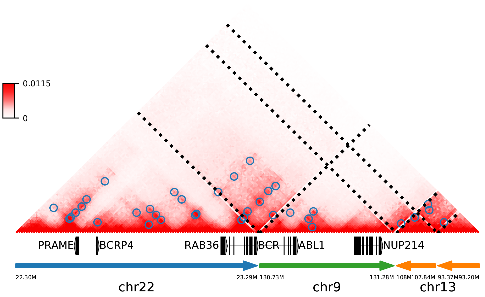

Neo-loop Finder
***************
NeoLoopFinder is a computational framework for detecting enhancer-hijacking events
from Hi-C data in re-arranged genomes. Given Hi-C contact data and SV breakpoints in
the genome, NeoLoopFinder can eliminate CNV biases, assemble complex SVs whenever possible,
normalize allelic effects within local assemblies, and predict SV-induced neo-loops. To
facilitate visualization and the integration with other omics data, NeoLoopFinder also provides
a module to generate browser-like plots for local SV assemblies.

Citation
========
Wang, X., Xu, J., Zhang, B., Hou, Y., Song, F., Lyu, H., Yue, F. Genome-wide detection of
enhancer-hijacking events from chromatin interaction data in re-arranged genomes. Nat Methods. 2021.

Installation
============
NeoLoopFinder and all the dependencies can be installed using `conda <https://conda.io/miniconda.html>`_
or `pip <https://pypi.org/project/pip/>`_::

    $ conda config --add channels defaults
    $ conda config --add channels bioconda
    $ conda config --add channels conda-forge
    $ conda create -n neoloop python=3.7.1 cython=0.29.13 cooler=0.8.6 numpy=1.17.2 scipy=1.3.1 joblib=0.13.2 scikit-learn=0.20.2 networkx=1.11 pyensembl=1.8.0 matplotlib=3.1.1 pybigwig=0.3.17 pomegranate=0.10.0
    $ conda activate neoloop
    $ conda install -c r r rpy2 r-mgcv
    $ pip install neoloop TADLib==0.4.2 coolbox==0.1.7

Overview
========
neoloop-finder is distributed with 8 scripts. You can learn the basic usage of each script
by typing ``command [-h]`` in a terminal window, where "command" is one of the following
script names:

- calculate-cnv

  Calculate the copy number variation profile from Hi-C map using a generalized additive model with the Poisson link function

- segment-cnv

  Perform HMM segmentation on a pre-calculated copy number variation profile.

- correct-cnv

  Remove copy number variation effects from cancer Hi-C.

- simulate-cnv

  Simulate CNV effects on a normal Hi-C. The inputs are the Hi-C matrix of a normal cell in .cool format,
  the Hi-C matrix of a cancer cell in .cool format, and the CNV segmentation file of the same cancer cell
  in bedGraph format.

- assemble-complexSVs

  Assemble complex SVs. The inputs are a list of simple SVs and the Hi-C matrix of the same sample.

- neoloop-caller

  Identify neo-loops across SV breakpoints. The required inputs are the output SV assemblies from
  ``assemble-complexSVs`` and the corresponding Hi-C map in .cool format.

- neotad-caller

  Identify neo-TADs. The inputs are the same as ``neoloop-caller``.

- searchSVbyGene

  Search SV assemblies by gene name.

Format of the input SV list
===========================
The input SV file to the command ``assemble-complexSVs`` should contain following 6 columns separated by tab::

    chr7    chr14   ++      14000000        37500000        translocation
    chr7    chr14   --      7901149 37573191        translocation

1. **chrA**: The chromosome name of the 1st breakpoint.
2. **chrB**: The chromosome name of the 2nd breakpoint.
3. **orientation**: The orientation type of the fusion, one of ++, +-, -+, or --.
4. **b1**: The position of the 1st breakpoint on *chrA*.
5. **b2**: The position of the 2nd breakpoint on *chrB*.
6. **type**: SV type. Allowable choices are: *deletion*, *inversion*, *duplication*, and *translocation*.

Tutorial
========
This tutorial will cover the basic usage of ``assemble-complexSVs``, ``neoloop-caller`` and the
visualization module.

First, change your current working directory to the *test* folder and download the Hi-C contact map in K562::

    $ cd test
    $ wget -O K562-MboI-allReps-hg38.10K.cool https://www.dropbox.com/s/z3z5bye1tuywf18/K562-MboI-allReps-hg38.10K.cool?dl=0

To detect and assemble complex SVs in K562, submit the command below::

    $ assemble-complexSVs -O K562 -B K562-test-SVs.txt -H K562-MboI-allReps-hg38.10K.cool

The job should be finished within 1 minute, and all candidate local assemblies will be reported into
a TXT file named "K562.assemblies.txt"::

    A0	translocation,22,23290555,+,9,130731760,-	translocation,9,131280137,+,13,108009063,+	deletion,13,107848624,-,13,93371155,+	22,22300000	13,93200000
    A1	translocation,9,131280000,+,13,93252000,-	deletion,13,93371155,+,13,107848624,-	9,130720000	13,108030000
    A2	translocation,22,23290555,+,9,130731760,-	translocation,9,131280000,+,13,93252000,-	22,22300000	13,93480000
    A3	translocation,22,23290555,+,9,130731760,-	translocation,9,131199197,+,22,16819349,+	22,22300000	22,16240000
    C0	deletion,13,93371155,+,13,107848624,-	13,93200000	13,108030000
    C1	translocation,22,16819349,+,9,131199197,+	22,16240000	9,130710000
    C2	translocation,22,23290555,+,9,130731760,-	22,22300000	9,131290000
    C3	translocation,9,131280000,+,13,93252000,-	9,130720000	13,93480000
    C4	translocation,9,131280137,+,13,108009063,+	9,130720000	13,107810000

Then you can detect neo-loops on each assembly using the ``neoloop-caller`` command::

    $ neoloop-caller -O K562.neo-loops.txt -H K562-MboI-allReps-hg38.10K.cool --assembly K562.assemblies.txt --no-clustering --prob 0.95

Wait ~1 minute... The loop coordinates in both shuffled (neo-loops) and undisrupted regions near SV breakpoints will be
reported into "K562.neo-loops.txt" in `BEDPE <https://bedtools.readthedocs.io/en/latest/content/general-usage.html>`_ format::

    $ head K562.neo-loops.txt

    chr13	93270000	93280000	chr13	107860000	107870000	A0,130000,1
    chr13	93270000	93280000	chr13	107870000	107880000	A0,140000,1
    chr13	93270000	93280000	chr13	107980000	107990000	A0,250000,1
    chr13	93280000	93290000	chr13	107860000	107870000	A0,120000,1
    chr13	93280000	93290000	chr13	107870000	107880000	A0,130000,1,C0,130000,1
    chr13	93280000	93290000	chr13	107880000	107890000	A0,140000,1
    chr13	93280000	93290000	chr13	107970000	107980000	A0,230000,1
    chr13	93290000	93300000	chr13	107860000	107870000	A1,110000,1,C0,110000,1
    chr13	93290000	93300000	chr13	107870000	107880000	A1,120000,1,A0,120000,1,C0,120000,1
    chr13	93300000	93310000	chr13	107870000	107880000	C0,110000,1

The last column records the assembly IDs, the genomic distance between two loop anchors on the assembly and whether this
is a neo-loop. For example, for the 1st row above, the loop was detected on the assemblies "A0", the genomic
distance between the two anchors on this assembly is 130K (note that the distance on the reference genome is >14Mb),
and it is a neo-loop as indicated by "1".

Finally, let's reproduce the figure 1b using the python code below (we recommend using `ipython <https://ipython.org/>`_
to explore it interactively)::

    In [1]: from neoloop.visualize.core import * 
    In [2]: import cooler
    In [3]: clr = cooler.Cooler('K562-MboI-allReps-hg38.10K.cool')
    In [4]: assembly = 'A0      translocation,22,23290555,+,9,130731760,-       translocation,9,131280137,+,13,108009063,+      deletion,13,107848624,-,13,93371155,+   22,22300000     13,93200000'
    In [5]: vis = Triangle(clr, assembly, n_rows=3, figsize=(7, 4.2), track_partition=[5, 0.4, 0.5])
    In [6]: vis.matrix_plot(vmin=0)
    In [7]: vis.plot_chromosome_bounds(linewidth=2.5)
    In [8]: vis.plot_loops('K562.neo-loops.txt', face_color='none', marker_size=40, cluster=True)
    In [9]: vis.plot_genes(filter_=['PRAME','BCRP4', 'RAB36', 'BCR', 'ABL1', 'NUP214'],label_aligns={'PRAME':'right','RAB36':'right'}, fontsize=9) 
    In [10]: vis.plot_chromosome_bar(name_size=11, coord_size=4.8)
    In [11]: vis.outfig('K562.A0.pdf')

